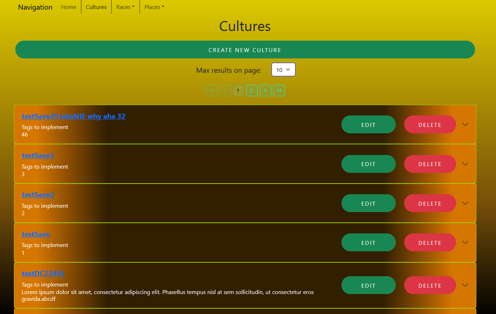
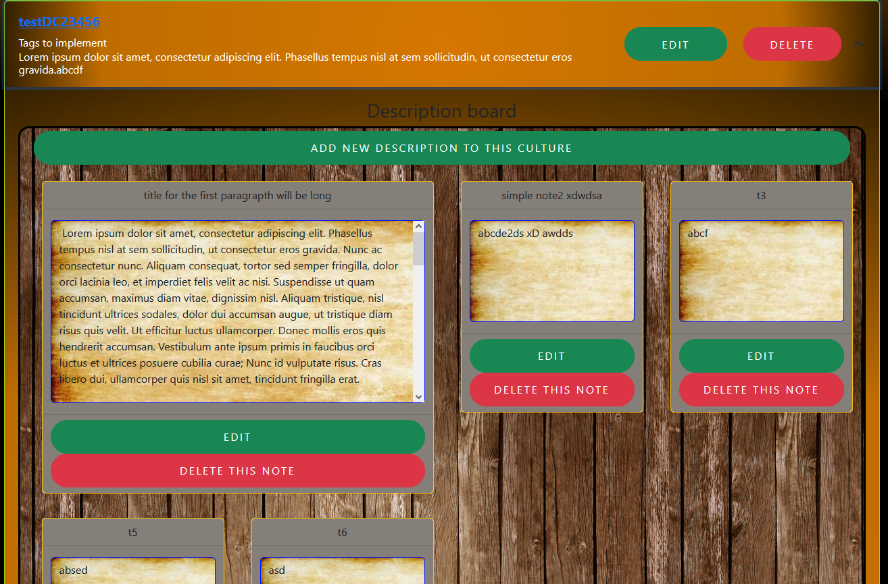
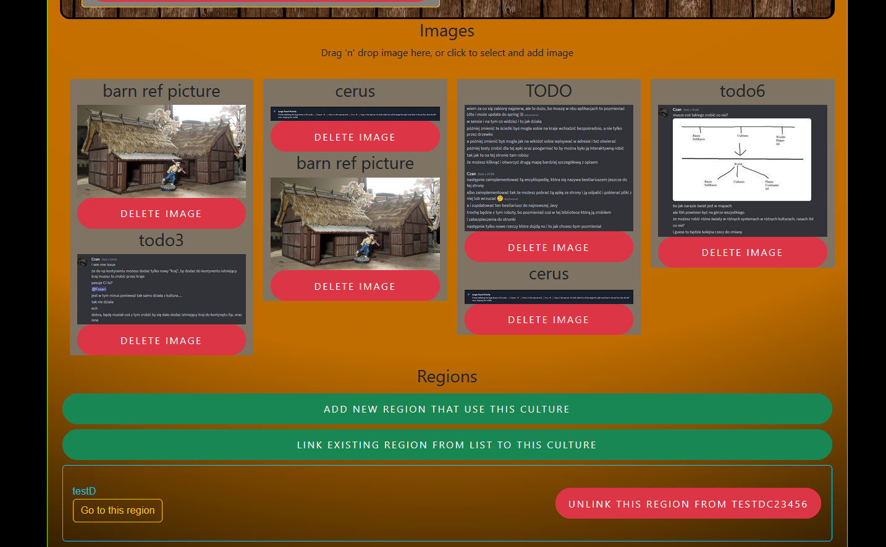

<h1> DnDWebsite </h1>
Website to write and store data of races, cultures and places.

Main view of adding new entry.

Description board.

Adding images and linking cultures to regions.

<h2> How to run it locally </h2>

1. You need to install on your computer:
  - Java 17,
  - Node,
  - PostgreSQL

OR using Docker
 - Docker

2. Create an .env file in main folder with specified values:
- `DBUSERNAME=username` - name of user which have access to database you want to use 
- `DBPASSWORD=password` - password used for specified user in database
- `DBURL=name:port` - on which your database function,
if you use docker this value should be a name given to container that runs your database,
for example "database" as specified in docker-compose.yaml file at line 4.
- `DBNAME=name` - name of created database, you need to create it before you can run the application. 
Just an empty database is sufficient
  
3. To run this by hand:
- Open main folder in your IDE and run program from file located in src/main/java/com.as.dndwebsite/DnDWebsiteApplication .
If you want to close it, just exit your IDE or stop it via options available in IDE.
- Open in terminal frontend folder "DnDWebsite\src\main\frontend" and write to commands `npm install` and after all have been installed `npm start`.
If you want to close it, click `ctrl+c` in terminal in which you ran earlier commands.

OR using docker
- Create docker image for backend from main folder using `Dockerfile` via command `docker build`
- Create docker image for frontend from "src/main/frontend" using the same method as above
- Create docker image for database, instruction for that are located in database folder, either follow them
or pull database image from docker hub and after that add a new database inside of it named like name you specified before in .env file.
- When you have them all created as images you can run them via `Docker-compose.yaml` file, but first update names to match
those of created images, then run it via command `docker-compose up`. Then in the same terminal you can close them via clicking
`ctrl+c`, or if you ran `docker compose up -r` to have free terminal use command `docker-compose stop`. To restart them later
use command `docker-compose start`.

That's it, you have running application where you can describe your world and when you meet for session you can show them
what you made. This application is still under development to be able to connect and show everything via internet.